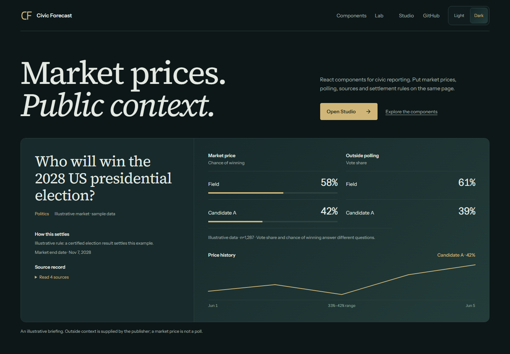
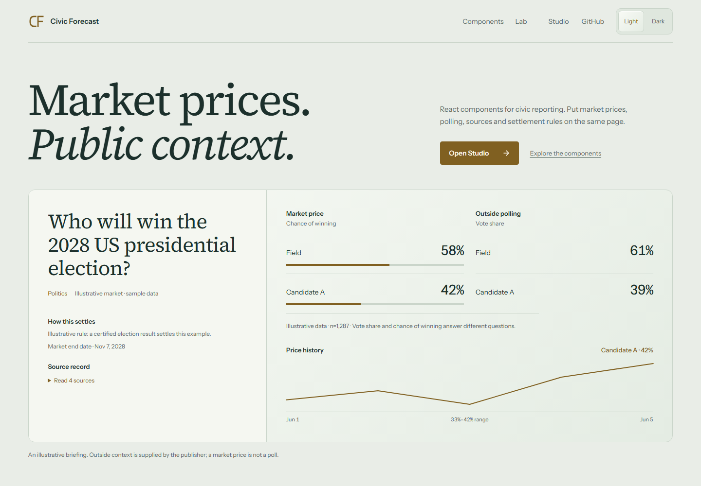

<p align="center">
  
  
  
  
</p>

<h1 align="center">Polymarket UI Kit</h1>

<p align="center">
  <strong>Drop-in React components, public data hooks, Link-to-Embed Studio, Combo-aware UI, and copy-in registry items for Polymarket apps.</strong>
</p>

<p align="center">
  <a href="#60-second-quickstart">Quickstart</a> &middot;
  <a href="#components">Components</a> &middot;
  <a href="#link-to-embed-studio">Studio</a> &middot;
  <a href="#data-architecture">Data</a> &middot;
  <a href="#ssrisr">SSR/ISR</a> &middot;
  <a href="#builder-and-grant-angle">Builder angle</a>
</p>

<h3 align="center">Civic Forecast · Dark Preview</h3>



<details>
<summary>Light preview</summary>



</details>

Build election briefings, market cards, evidence rails, poll comparisons, probability charts, orderbook panels, comment feeds, builder
badges, fee previews, leaderboard tables, combo leg pickers, mobile trade
previews, and social share cards without rebuilding the same Polymarket UI layer
from scratch.

This project is built for frontend developers, media tools, embeddings, dashboard
builders, content products, and research portals that need Polymarket-native UI
with strong defaults and clean escape hatches.

The screenshots show the Civic Forecast demo with explicitly labeled sample data.
The design uses Instrument Sans, dark teal panels, inset data blocks, and brass
controls. Its election briefing separates market odds, outside polling, source
records, and settlement rules. The component lab uses a draggable dial to select
sections, with keyboard tabs and a horizontal scale on small screens.
See [DESIGN.md](DESIGN.md) for the visual system and
[the release guide](docs/release.md) for checks and publication steps.

## Election Briefing

`ElectionBriefCard` is the opinionated surface for civic reporting. It ranks
market outcomes, shows poll vote share separately from winning probability,
and keeps resolution criteria and sources in the same reading path. A host
application supplies polls, evidence, and the resolution summary; the kit does
not fetch or verify outside political data. If those inputs are absent, the
card says so instead of filling the gaps with sample facts.

```tsx
import { ElectionBriefCard } from "@polymarket-ui-kit/react";

<ElectionBriefCard
  market={market}
  polls={verifiedPollRows}
  evidence={verifiedSources}
  resolutionSummary={verifiedResolutionRule}
  sourceLabel="Live public market"
/>;
```

The general `MarketCard` uses the same ranked, percentage-first language for
non-election markets. `ShareCard` and PNG/SVG exports carry the same panel
style into embeds and social previews.

## Turn Any Polymarket Link Into A Live Market Card

```tsx
import { MarketCard, useMarket } from "@polymarket-ui-kit/react";
import "@polymarket-ui-kit/react/styles.css";
import "@polymarket-ui-kit/react/themes.css";

export function LiveMarketCard({ slug }: { slug: string }) {
  const { data: market, isLoading, error } = useMarket(slug);

  if (isLoading) return <div>Loading market...</div>;
  if (error || !market) return <div>Market unavailable</div>;

  return <MarketCard market={market} href={market.url} />;
}
```

## 60-Second Quickstart

Install target for the first npm prerelease:

```bash
pnpm add @polymarket-ui-kit/react
```

Run the current repo locally today:

```bash
pnpm install
pnpm build
pnpm demo:dev
```

Hosted registry target for shadcn-style projects:

```bash
npx shadcn@latest add https://polymarket-ui-kit-demo-fkan-chi.vercel.app/r/market-card.json
```

The current hosted registry lives on the Vercel demo domain. A custom registry
domain is planned after the first public release.

Import styles once:

```tsx
import "@polymarket-ui-kit/react/styles.css";
import "@polymarket-ui-kit/react/themes.css";
```

## Current Status

| Surface               | Status                                                       |
| --------------------- | ------------------------------------------------------------ |
| Live demo             | Deployed                                                     |
| Local development     | `pnpm install`, `pnpm build`, then `pnpm demo:dev`           |
| React package         | First npm prerelease planned                                 |
| Core package          | First npm prerelease planned                                 |
| Hosted registry       | Live on the Vercel demo domain                               |
| Registry source       | Available in `packages/registry`                             |
| Advanced Builder Flow | Dry-run example available in `examples/clob-v2-builder-flow` |
| Authenticated trading | Out of scope for v0                                          |

## Link-To-Embed Studio

Paste a Polymarket URL or slug and generate a live iframe, React snippet, OG
PNG/SVG links, and shadcn-style registry command from one surface.

Live Studio:
[polymarket-ui-kit-demo-fkan-chi.vercel.app/studio](https://polymarket-ui-kit-demo-fkan-chi.vercel.app/studio)

```tsx
import {
  buildIframeSnippet,
  buildShareImageUrl,
  resolvePolymarketSlug,
} from "@polymarket-ui-kit/core";

const slug = resolvePolymarketSlug(
  "https://polymarket.com/event/who-will-win-the-2028-us-presidential-election",
);

const iframe = buildIframeSnippet({
  slug,
  baseUrl: "https://your-app.com",
  surface: "share-card",
  theme: "dark",
});

const ogPng = buildShareImageUrl({ slug, format: "png", theme: "dark" });
```

Read the implementation notes in [docs/embed-studio.md](docs/embed-studio.md).

Studio starts with `sample`, a reserved demo slug. Real market slugs load public
Polymarket data. If a request fails, the page shows an unavailable state and image
exports return HTTP 503; neither substitutes sample prices for a requested market.

## Copy-Paste Examples

Market card:

```tsx
import { getMarketBySlug } from "@polymarket-ui-kit/core";
import { MarketCard } from "@polymarket-ui-kit/react";

export default async function Page({ params }: { params: { slug: string } }) {
  const market = await getMarketBySlug(params.slug);
  return <MarketCard market={market} href={market.url} />;
}
```

Orderbook panel:

```tsx
import { OrderbookPanel, useOrderbook } from "@polymarket-ui-kit/react";

export function Depth({ tokenId }: { tokenId: string }) {
  const { data, isLoading } = useOrderbook(tokenId);
  if (isLoading) return <div>Loading depth...</div>;
  return <OrderbookPanel orderbook={data} />;
}
```

Share image card:

```tsx
import { ShareCard } from "@polymarket-ui-kit/react";

export function MarketScreenshot({ market }) {
  return <ShareCard market={market} attribution="your-product.com" />;
}
```

## Real Public Hooks And Share Export

The kit now ships public, no-auth hooks for live market data, depth, comments,
leaderboards, and historical CLOB price points. Hooks accept either old-style
`initialData` or an options object for SSR/ISR fallbacks.

```tsx
import { MarketCard, useMarket, usePriceHistory } from "@polymarket-ui-kit/react";

export function LiveMarket({ slug, tokenId, initialMarket }) {
  const market = useMarket(slug, {
    initialData: initialMarket,
    refetchOnMount: false,
    refetchIntervalMs: 60_000,
  });
  const history = usePriceHistory({ tokenId, interval: "1w", fidelity: 60 });

  if (!market.data) return <div>Market unavailable</div>;
  return <MarketCard market={market.data} points={history.data ?? []} />;
}
```

For social previews and media embeds, generate PNG or SVG share images from the
same market data.

```tsx
import { useShareImage } from "@polymarket-ui-kit/react";

export function ShareLinks({ slug }) {
  const png = useShareImage({ slug, format: "png", theme: "light" });
  const svg = useShareImage({ slug, format: "svg", theme: "light" });

  return <a href={png.url}>Open share image</a>;
}
```

Server-side SVG export is framework-agnostic:

```tsx
import { createShareCardSvg, getMarketBySlug } from "@polymarket-ui-kit/core";

export async function GET(request: Request) {
  const slug = new URL(request.url).searchParams.get("slug")!;
  const market = await getMarketBySlug(slug);
  return new Response(createShareCardSvg(market, { theme: "light" }), {
    headers: { "content-type": "image/svg+xml" },
  });
}
```

Read the deeper notes in [docs/share-export.md](docs/share-export.md).

## Combo-Aware UI

Combos turn multiple market legs into one richer prediction surface. The kit now
ships the read-first UI layer for that workflow: public combo-market discovery,
leg picking, combo share cards, and typed intent payloads for host apps.

```tsx
import { ComboBuilderCard, useComboMarkets } from "@polymarket-ui-kit/react";

export function ComboSurface() {
  const combos = useComboMarkets({ limit: 12 });

  return (
    <ComboBuilderCard
      markets={combos.data?.markets ?? []}
      onComboIntent={(intent) => {
        // Host apps pass intent.legs[].positionId into their own RFQ flow.
      }}
    />
  );
}
```

No quote submission, no signing, no hidden order placement. Read the notes in
[docs/combos.md](docs/combos.md).

## Builder-Code-Aware UX

Builder Codes are public `bytes32` identifiers used by host applications when they submit Polymarket CLOB V2 orders. This kit does not place orders, but it helps builders make attribution and fee disclosure clear before handing off a trade intent.

```tsx
import {
  BuilderFeeDisclosure,
  MobileTradeDrawer,
  PolymarketProvider,
} from "@polymarket-ui-kit/react";

const builder = {
  name: "Forecast Studio",
  handle: "@forecast-studio",
  code: process.env.NEXT_PUBLIC_POLY_BUILDER_CODE,
  takerFeeBps: 25,
  makerFeeBps: 10,
};

export function BuilderAwareMarket({ market }) {
  return (
    <PolymarketProvider builder={builder}>
      <BuilderFeeDisclosure builder={builder} notional={100} side="taker" />
      <MobileTradeDrawer
        market={market}
        onTradeIntent={(intent) => {
          // Pass intent.builderCode into your own CLOB V2 order flow.
        }}
      />
    </PolymarketProvider>
  );
}
```

Read the implementation notes in [docs/builder-codes.md](docs/builder-codes.md).

## Advanced: Verifiable Builder Flow

For grant reviewers and builders testing attribution, the repo includes an
advanced host-app example that converts a UI Kit `TradeIntent` into a CLOB V2
market-order draft with `builderCode` attached.

```tsx
import { buildClobV2MarketOrderDraft } from "@polymarket-ui-kit/core";

const draft = buildClobV2MarketOrderDraft({
  builderCode: intent.builderCode,
  market: intent.market,
  notional: intent.notional,
  outcome: intent.outcome,
});
```

The example is dry-run by default. Live submission is server-only and requires
`POLY_ENABLE_LIVE_ORDERS=true` plus explicit CLOB/wallet env vars.

Builder attribution is verifiable after a matched fill:
`TradeIntent -> CLOB V2 order with builderCode -> fill -> OrderFilled event -> builder field`.

Run it locally:

```powershell
pnpm.cmd --filter @polymarket-ui-kit/example-clob-v2-builder-flow dev
```

Read the verification notes in
[docs/verifiable-builder-flow.md](docs/verifiable-builder-flow.md).

## Components

| Component              | Purpose                                                   | Status |
| ---------------------- | --------------------------------------------------------- | ------ |
| `MarketHeader`         | Question, status, category, volume, expiry, builder badge | MVP    |
| `EvidenceRail`         | Official, poll, model, news, and other source context     | MVP    |
| `PollMarketComparison` | Responsive poll-share and market-probability comparison   | MVP    |
| `ElectionBriefCard`    | Market odds, polls, sources, and settlement context       | MVP    |
| `MarketCard`           | Ranked outcome sheet for embeds and links                 | MVP    |
| `ProbabilitySparkline` | Lightweight inline price movement                         | MVP    |
| `ProbabilityChart`     | Multi-series probability chart                            | MVP    |
| `OrderbookPanel`       | Bid/ask depth with spread and totals                      | MVP    |
| `OutcomeSwitcher`      | Yes/No or multi-outcome selector                          | MVP    |
| `FeePill`              | Platform and builder fee preview                          | MVP    |
| `CommentList`          | Public market comments                                    | MVP    |
| `ComboBuilderCard`     | Combo leg picker, selected legs, and intent preview       | MVP    |
| `ComboLegPicker`       | Public combo-market leg selection                         | MVP    |
| `ComboLegList`         | Selected combo legs with outcome and price context        | MVP    |
| `ComboIntentPreview`   | Typed combo intent handoff for host apps                  | MVP    |
| `ComboShareCard`       | Social/embed surface for selected combo legs              | MVP    |
| `EmbedSnippetPanel`    | Copy-ready iframe, React, OG, and registry outputs        | MVP    |
| `BuilderBadge`         | Builder identity and attribution surface                  | MVP    |
| `BuilderFeeDisclosure` | Builder code attribution and maker/taker fee disclosure   | MVP    |
| `ShareCard`            | X-ready market screenshot and OG card base                | MVP    |
| `LeaderboardTable`     | Trader leaderboard rows                                   | MVP    |
| `MobileTradeDrawer`    | Read-first trade intent preview                           | MVP    |

## Data Architecture

Polymarket UI Kit is read-first in v0. It defaults to public market data and
does not place authenticated orders.

| Source         | Used for                                           | Auth                   |
| -------------- | -------------------------------------------------- | ---------------------- |
| Gamma API      | markets, events, search, comments, profiles        | No                     |
| Data API       | positions, trades, leaderboards, builder analytics | No                     |
| CLOB API       | orderbooks, midpoints, spreads, `prices-history`   | Public for market data |
| CLOB WebSocket | live book and price updates                        | No for market channel  |
| Combo RFQ API  | public combo market discovery                      | No for catalog         |

The core package normalizes API responses into stable UI types so components can
accept either preloaded server data or client-side hooks.

## SSR/ISR

Server-load with `@polymarket-ui-kit/core`, render with
`@polymarket-ui-kit/react`, then refresh client-side only where live updates are
needed.

```tsx
import { getMarketBySlug } from "@polymarket-ui-kit/core";
import { MarketCard } from "@polymarket-ui-kit/react";

export const revalidate = 60;

export default async function MarketPage({ params }: { params: { slug: string } }) {
  const market = await getMarketBySlug(params.slug);
  return <MarketCard market={market} points={[]} />;
}
```

## Theming

The package ships CSS variables and a tiny theme provider. You can use it as-is,
override variables, or copy registry files into your own design system.

```css
:root {
  --pui-accent: #0f766e;
  --pui-radius-md: 8px;
}
```

## Why This Exists

The Polymarket ecosystem has dashboards, APIs, bots, and trading tools. What is
still weak is the frontend layer: polished market primitives that a builder can
drop into a media product, research portal, dashboard, or embed in minutes.

The moat is not just visual polish. It is DX:

- first-class TypeScript types
- no-auth public data defaults
- SSR/ISR-friendly APIs
- Storybook and visual states
- shadcn-style copy-in registry
- link-to-embed studio and snippet generation
- launch-ready share cards
- combo-aware leg picking and intent payloads
- builder-code-aware fee and attribution surfaces

## Demo Links

- Live demo: [polymarket-ui-kit-demo-fkan-chi.vercel.app](https://polymarket-ui-kit-demo-fkan-chi.vercel.app/)
- Link-to-Embed Studio: [studio](https://polymarket-ui-kit-demo-fkan-chi.vercel.app/studio)
- Hosted registry: [registry.json](https://polymarket-ui-kit-demo-fkan-chi.vercel.app/registry.json)
- Registry item: [embed-studio.json](https://polymarket-ui-kit-demo-fkan-chi.vercel.app/r/embed-studio.json)
- Demo OG PNG: [api/og](https://polymarket-ui-kit-demo-fkan-chi.vercel.app/api/og?slug=who-will-win-the-2028-us-presidential-election&theme=light&format=png)
- Demo OG SVG: [api/og?format=svg](https://polymarket-ui-kit-demo-fkan-chi.vercel.app/api/og?slug=who-will-win-the-2028-us-presidential-election&theme=light&format=svg)
- Docs app: `pnpm docs:dev`
- Demo app: `pnpm demo:dev`
- Storybook: `pnpm storybook`
- Registry validation: `pnpm registry:validate`

## Builder And Grant Angle

This is an independent open-source project for the Polymarket ecosystem. The
goal is to help more teams build market-native interfaces, distribute markets
into vertical apps, and make builder-code-aware UX easier to ship.

Grant submission checklist:

- Repo: [github.com/horn111/polymarket-ui-kit](https://github.com/horn111/polymarket-ui-kit)
- Live demo: [polymarket-ui-kit-demo-fkan-chi.vercel.app](https://polymarket-ui-kit-demo-fkan-chi.vercel.app/)
- Link-to-Embed Studio: [studio](https://polymarket-ui-kit-demo-fkan-chi.vercel.app/studio)
- X account: [x.com/debythm](https://x.com/debythm)
- Advanced Builder Flow: [examples/clob-v2-builder-flow](examples/clob-v2-builder-flow)
- Grant application draft: [docs/grant-application.md](docs/grant-application.md)
- 60-second demo script: [docs/demo-script.md](docs/demo-script.md)
- Screenshot checklist: [docs/screenshot-checklist.md](docs/screenshot-checklist.md)

The repo includes:

- [Grant application draft](docs/grant-application.md)
- [Grant strategy](docs/grant-strategy.md)
- [Grant tweet thread](docs/grant-tweet-thread.md)
- [Demo script](docs/demo-script.md)
- [Screenshot checklist](docs/screenshot-checklist.md)
- [Launch playbook](docs/launch-playbook.md)
- [Tweet templates](docs/tweet-templates.md)
- [Builder Codes notes](docs/builder-codes.md)
- [Verifiable Builder Flow](docs/verifiable-builder-flow.md)
- [Combo-aware UI notes](docs/combos.md)
- [Link-to-Embed Studio](docs/embed-studio.md)

## Roadmap

See [ROADMAP.md](ROADMAP.md).

## Contributing

See [CONTRIBUTING.md](CONTRIBUTING.md). Component requests, examples, visual
states, accessibility fixes, and adapter improvements are all welcome.

## Disclaimer

Polymarket UI Kit is not affiliated with Polymarket. It is open-source frontend
tooling for builders using public Polymarket data and APIs.

## License

MIT. See [LICENSE](LICENSE).
