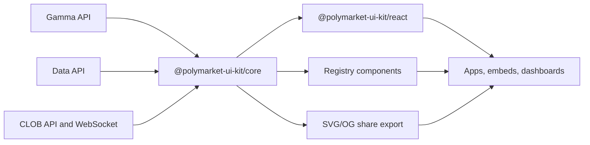

# Architecture

Polymarket UI Kit is a hybrid distribution project:

- `@polymarket-ui-kit/core` normalizes public Polymarket data.
- `@polymarket-ui-kit/react` renders typed UI primitives.
- `@polymarket-ui-kit/registry` exposes copy-in components for shadcn-style apps.
- `@polymarket-ui-kit/cli` helps developers discover install commands.
- `apps/docs`, `apps/demo`, and Storybook provide the adoption surface.

The core package avoids React so it can be used in server components, API routes,
workers, share-image generation, and static generation jobs.

## Data flow

## v0 boundary

v0 does not place orders. It can preview fees, display market data, generate
share images, and emit a host-provided trade intent callback.
